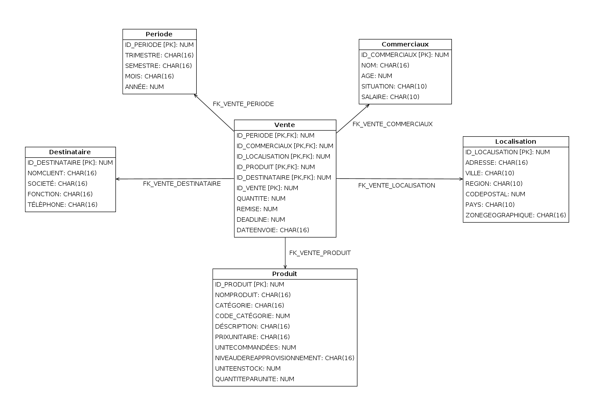
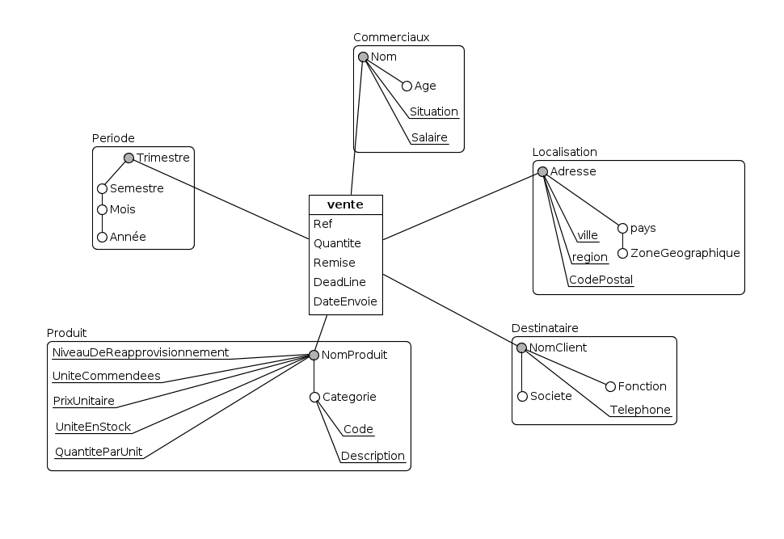
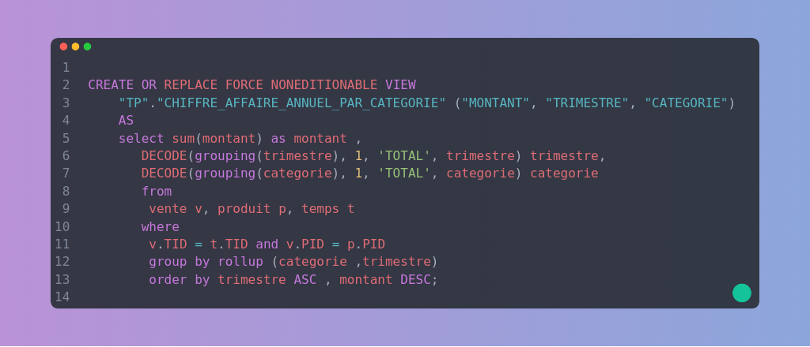
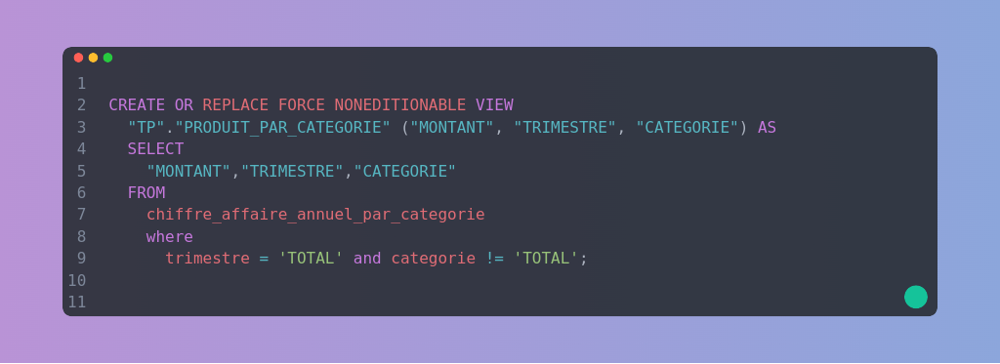
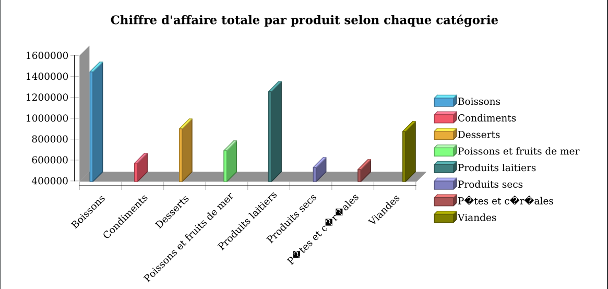

# Data Warehousing and vizualisation
    In this project i tried to use all the technologies i've learned in my master first year in data 
    warehousing and vizualisation. 
    The project contains two major steps :
        * Design and creation of a DataWarehouse ( Star schema and ETL )
        * Combine the data in datasets and put them together in a pdf report

## Step 1 : Data Warehousing
### Talend Studio 
    In this section I combined all our data sources to create a proper metadata using oracle
    and sqlite database connections, an XML file and a CSV file.

#### Model Design
    In this part i used ' Bimodeler ' to design my dimension and relationnel models
###
-> Relationel model

-> Dimensionnel model 

#### Model Creation
    As you can see in the file shéma_étoil.sql, I created the schema in Oracle-Sqldev 
    using a virtual machine

#### Jobs Creation 
    In each job I creat a metadata input, an oracle output and a log object to view my fields on the console.
    Here are some different job examples for you :

----> Client Job

    This job combined an execl file and an Sqlite table to a MAP in order to push them in our oracle table

----> Commerciaux Job
    
    This is a XML to Oracle Job 

----> Periode Job
    
    This is a Sqlite to Oracle Job

## Step 2 : Data Vizualisation (Reporting)
### Eclipse Birt
    Once I finished the Data warehousing, I jumpte to Birt in order to create an example 
    data vizualisation report as you can see in the folder Reporting/Exemple_rapport.pdf

#### Data Source : 
    In this secition we make sure to create a new datasource and connect it with the oracle
    data warehouse running on the current PORT 

#### Data set :
    This section use the previous data source which is connected to our data warehouse and use SQL requests
    to answer your client specifications. you can create as many as you want.
    All the possible answers to the specifications are in the Reporting/Requete.sql file 

#### Concrete example
    This is a preview on how we can create a dataset and plot it properly : 
----> Data set creation : ( Total turnover by product filtred by categorie )
#####
I created a view that select annuel turnover by product filtred by categorie : 

####
Then I created my dataset that select from this view with a total condition :

----> Chart Creation and vizualisation : 

    Once you have your datasets ready you can chose from birt Chart any type chose 
    the dataset that you want to plot affect the values to the exact rows and their 
    you are

    
    You can see the full report on the repo. And if you made it this far 
    thank you for reading this 💖

    

        